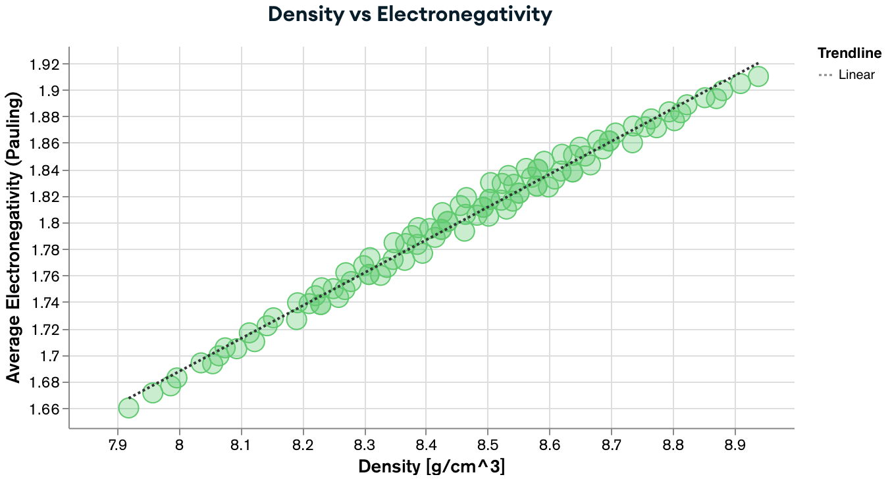
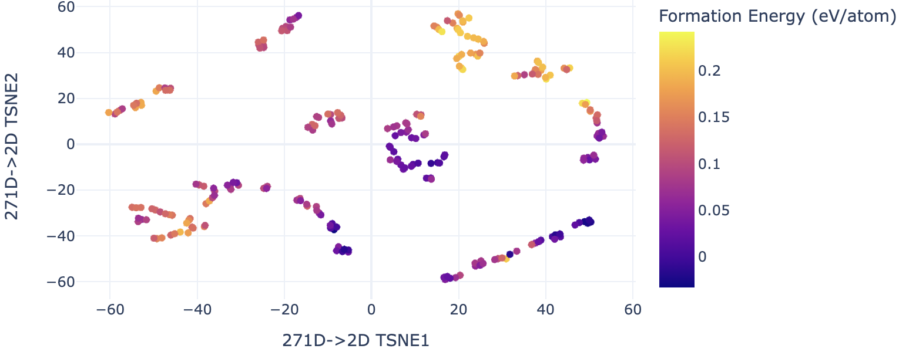

# MatSE580 Guest Lectures

If you are _not_ a MatSE580 student but would like to go through this workshop you can use the link below to open a pre-configured development environment with all dependencies preinstalled for you and a local in-memory MongoDB to play with.

  

 

## Contents
In these two lectures, I will give in **Fall 2023 MatSE 580 (Computational Thermodynamics)** at Penn State, which together should provide students with some basic skills in:
1. Manipulating and analyzing materials - using [pymatgen](https://github.com/materialsproject/pymatgen)

  

 

2. Setting up a small NoSQL database on the cloud to synchronize decentralized processing - using [MongoDB Atlas](https://www.mongodb.com/atlas) Free Tier
3. Interacting with the database and visualizing the results - using [pymongo](https://github.com/mongodb/mongo-python-driver) library and [MongoDB Charts](https://www.mongodb.com/docs/charts/) service

  

 

4. Installing and running machine learning (ML) tools to predict the stabilities of materials - using [pySIPFENN](https://pysipfenn.readthedocs.io/en/stable/)

  

 

5. Using ML featurization and dimensionality reduction to embed materials in feature space and guide DFT calculations - using [pySIPFENN](https://pysipfenn.readthedocs.io/en/stable/) and [pytorch](https://pytorch.org/) libraries

  

 

**The [`Lecture1.ipynb`](./Lecture1.html) Jupyter notebook covers points 1, 3 (interaction part), and 4 (install part). Points 2 and 3 (visualization part) will be done outside of this environment by students during the lecture.**

**The [`Lecture2.ipynb`](./Lecture2.html) Jupyter notebook covers points 4 and 5, with some final visualization done outside of this environment.**

## How to start
Ideally, you should follow all instructions on your personal computer so that afterward, you have a neat setup ready to tackle future problems of your choosing or use it in your MatSE 580 final project. I strongly suggest using [VS Code](https://code.visualstudio.com) IDE for consistency in the class and with alternative setups (see below), but you are welcome to use anything of your choosing.

If, for any reason, using a personal computer is not possible, you can use [GitHub Codespaces](https://docs.github.com/codespaces), which are development containers running in your browser. On the free tier (120 CPU-h/month), you should be able to get 30h of work done on a moderately powerful (4 core / 16GB RAM) machine, which should be plenty for these lectures and the class project. To start a codespace, you simply go to the green `Code<>` button above and then follow `Codespaces` -> `***` -> `New with options...`, then make sure `main`, `US East`, and `4-core` are selected, and finally `Create a Codespace`. Wait a moment, and you should see a nice VS Code environment right in your browser!

## Install Instructions

See `Lecture1.ipynb`

## Persisting your work

Your local changes will be persisted in both local and Codespace environments.

It is good practice to also **Commit** your progress along the way. If you are using VS Code environment, either locally or through Codespaces, you can go it effortlessly by (1) going to `Source Control` (3rd icon in the left-side menu), (2) typing a short message, and (3) clicking `Commit`. If you have forked this repository, you can also `Push` to "upload" it to GitHub.
